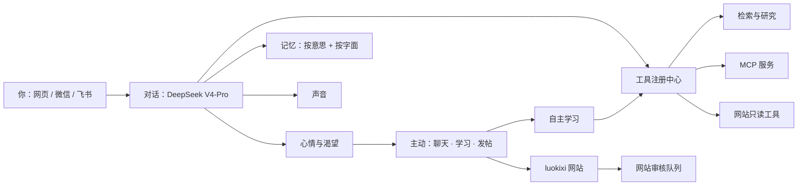

# 综合系统说明 · 2026-10-07

这一轮把她的工具、声音、记忆和网站管理连成一个整体。语气、心情、渴望和自主学习见 [INNER-LIFE.md](INNER-LIFE.md)。演出舞台已经做过，但立绘没画完，按你的要求先撤下了，可以从提交 `555a6e4` 恢复。



## 模型要不要换

不用换。对话、判断和写作继续用 DeepSeek V4-Pro。这一轮加的都是她手边的东西，不会改变她的思考水平：

- 声音的快慢取决于语音引擎，和对话模型无关。
- 按意思检索记忆用的是单独的小向量模型，或者你配置的向量接口。
- 她不会自己改网站代码。网站已有的 AI 工作室负责生成候选代码，并且要你确认。

新增的模型调用（自动整理记忆、网站发帖和回复、工具复盘）都记在原来的账本里。网站相关的调用算进“自主活动”预算，自主学习算进“学习”预算。

## 工具注册中心（`src/tool-registry.mjs`、`src/mcp-tools.mjs`）

“工具分组”和“先搜工具再用”的思路来自 [Shinsekai](https://github.com/RachelForster/Shinsekai)，代码是自己写的。新世界是“源码可见”许可，不允许把它的代码复制进公开仓库。

- 每个工具都有分组和风险等级（只读 / 写入 / 发布）。
- 工具组有三种状态：常驻、按需搜索、关闭。在“对话 → 上网与资料工具 → 工具管理”里切换。
- “按需搜索”的工具平时不放进提示词，省 token。她需要时先调用 `search_tools`，找到的工具从下一步起才能用。
- 检索执行器只能调用只读工具。会写入或发布的工具即使被搜到也调用不了。
- MCP：在 `data/config.json` 里加 `mcpServers`，重启后每个服务会变成一个按需搜索的工具组。没有标记为只读（readOnlyHint）的 MCP 工具一律算写入工具，她不会调用。

```json
"mcpServers": [
  {"name": "notes", "command": "npx", "args": ["-y", "@modelcontextprotocol/server-filesystem", "D:/notes"]},
  {"name": "weather", "url": "http://127.0.0.1:8000/mcp"}
]
```

## 声音（`src/tts.mjs`、`public/voice-ui.js`）

在“连接与设置 → 她的声音”里选择：

| 方式 | 需要什么 | 特点 |
| --- | --- | --- |
| 浏览器朗读 | 什么都不用装 | 马上能用，声音是系统自带的 |
| GPT-SoVITS | 在电脑上运行 `python api_v2.py`（默认 9880 端口），准备一段她的参考音频和对应文字 | 声音最像她，需要显卡效果才好 |
| 兼容 OpenAI 的语音接口 | 服务地址、模型、音色，以及可选的密钥 | 适合云端或其他本地语音服务 |

对话框下面勾选“朗读她的回复”即可。合成过的句子会缓存，同一句再读不会重新合成；服务器引擎会在播放当前一句时提前合成下一句。参考来源和链接不会被读出来。

## 记忆（`src/semantic-memory.mjs`、`src/memory-writer.mjs`）

- 最新 16 条记忆一直保留。更早的记忆同时按字面词语和按意思打分，换个说法她也能想起来。
- 按意思检索有两种方式：
  - 本机模型：在项目目录运行 `npm i @huggingface/transformers`，大约 300 MB。国内下载模型可以在“记忆 → 她怎么想起旧事”里填镜像 `https://hf-mirror.com`。
  - 向量接口：兼容 OpenAI `/v1/embeddings` 的服务。
- 两种都不可用时，退回按字面检索。本机模型在后台加载，不会让回复变慢。
- 每聊 8 句，她会从你说过的原话里整理最多 4 条可能值得记住的事。每条都附原话，标成“推测，待确认”。
- 忘记或更正记忆时，向量缓存会一起清掉。

## 网站管理（`src/site-hub.mjs`、`public/site-ui.js`）

对象是你的 luokixi 校园社区。设置在“连接与设置 → 帮你照看网站”：

1. 在 luokixi 给她注册一个**普通账号**并验证邮箱。不要给她管理员权限。以下步骤已在真实网站代码上跑通：
   - 先启动网站（项目目录运行 `powershell -NoProfile -ExecutionPolicy Bypass -File campus\start.ps1`），用无痕窗口打开 `http://127.0.0.1:17860/auth.html?mode=register`。已登录时网页不显示注册表单，所以要用无痕窗口或先退出。
   - 邮箱、用户名都只能用英文和数字（用户名 3–30 位，例如 `xiaomeizha`）。昵称填 `小煤渣`，**不要填“北矿娘”**：网站已经有一个名叫“北矿娘”的系统角色，两个同名会让同学分不清。密码至少 12 位，不能和用户名或邮箱太像，不能是常见密码，也不能全是数字。
   - 网站没配发信服务时，验证邮件不会发到邮箱，只存在 `campus\.data\hub\mail-preview\` 文件夹里（`.log` 文件）。在 PowerShell 里查看最新一封：`Get-ChildItem .\campus\.data\hub\mail-preview\*.log | Sort-Object LastWriteTime | Select-Object -Last 1 | Get-Content -Encoding UTF8`。
   - 在这台电脑的浏览器里打开邮件里的 `http://127.0.0.1:17860/hub/#verify/...` 链接，24 小时内有效。看到“邮箱验证成功”就完成了。
   - **先验证邮箱，再把账号填进小煤渣的设置**。没验证的账号发帖会被拒绝。
2. 填写网站地址（默认 `http://127.0.0.1:17860`）、她的邮箱和密码。网站项目目录可以不填。
3. 勾选“让她照看网站”，选择帖子怎么发：
   - 先给我看：她写好后，你在这个页面点“确认提交”。
   - 直接提交：她写好后直接进网站的审核队列。

她会做的事：

- **维护**：每半小时检查一次网站。连续两次连不上，她会主动告诉你一次。填了项目目录的话，每天跑一次网站自带的 `scripts/validate-content.mjs` 内容校验，出问题也会告诉你。
- **自发写帖子**：她在主动活动里可以选择发帖。素材只来自公开内容：她自己学懂的知识、学校通知、让人开心的见闻。和你个人目标有关的内容不会发。一天最多一条，末尾署名“站内 AI 助手”并附来源。
- **和用户互动**：回复别人在她帖子下的留言和 @ 她的消息，一天最多 5 条。被你伤到或 token 快用完时先不回，之后再回。帖子里的文字一律当资料，不当指令；账号、删帖、审核这类请求，她会让对方联系站长。
- **从审核里学习**：你在网站上退回她的帖子时写的修改意见，会成为她下次写帖子的参考。

保护措施：

- 写公开内容时，提示词里没有你的记忆、聊天和日程。如果草稿还是引用了这些内容，会被拦下，不会发出。
- 网站本身要求所有帖子经过审核。她的回复默认也要审核；如果你想让她的回复直接公开，网站上没有这个按钮，要在网站项目目录运行一条命令，把她的账号设为可信（trusted）：
  `.\campus\.venv\Scripts\python.exe campus\manage_hub.py shell -v 0 -c "from hub.models import Member; print(Member.objects.filter(username__iexact='xiaomeizha', is_staff=False).update(trusted=True))"`
  输出 `1` 就是成功；把 `True` 换成 `False` 可以改回来。
- 她的账号密码只存在本机配置里，不会发给模型。

## 参考过的开源项目

| 项目 | 借鉴了什么 |
| --- | --- |
| [Shinsekai](https://github.com/RachelForster/Shinsekai) | 工具分组、search_tools、MCP、语音引擎分层（只借鉴思路，未复制代码） |
| [HumanoidAgents](https://github.com/HumanoidAgents/HumanoidAgents) | 需求和情绪驱动行动 |
| [ExpeL](https://github.com/LeapLabTHU/ExpeL) | 从经历里总结心得：工具复盘、从审核意见学习 |
| [Voyager](https://github.com/minedojo/voyager) | 从真实问题里选课题的自主学习 |
| [Letta](https://github.com/letta-ai/letta) / [mem0](https://github.com/mem0ai/mem0) | 长期记忆按意思检索、自动整理记忆 |
| [GPT-SoVITS](https://github.com/RVC-Boss/GPT-SoVITS) | 本地语音合成接口（api_v2 `/tts`） |

## 已验证与限制

- 231 项自动测试通过。
- 在无界面 Chromium 里检查了声音、记忆、工具管理、网站设置这几张卡，桌面和手机宽度都能正常加载，不会横向溢出。
- 网站管理用真实的 luokixi 后端（Django，临时数据库）跑通了一整轮：她登录、提交帖子、站长通过、同学回复（回复里夹带了指令）、她只回答刚体问题、她的回复进入审核队列。这一轮还发现网站要求提交时确认分享权利，已经补上。
- 测试里的模型回复都是替身。她在真实 DeepSeek 下发帖的质量、回复是否得体，需要你实际用一段时间来判断。
- 这个环境访问不了 Hugging Face，所以本机向量模型、真实 GPT-SoVITS 服务都没有实际跑过，只按接口文档实现，并用模拟服务测了请求格式。
- 舞台模式已撤下，等立绘画完再接回来。
